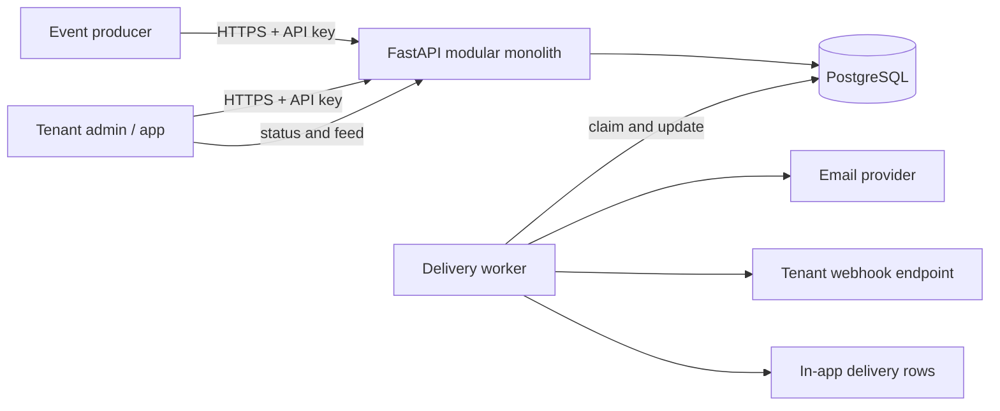

# Version 0 Architecture

## Purpose

This is a multi-tenant notification platform. A tenant-owned producer submits an
event; the platform persists it, creates notifications for requested recipients,
and delivers them through email, webhook, or an in-app feed.

V0 is deliberately a modular FastAPI application with PostgreSQL. PostgreSQL is
the durable state store and initial job queue. Redis, Kafka, microservices,
Kubernetes, and cloud infrastructure are deferred until measured needs justify
them.

## Learn before implementation

| Concept | Why it exists | V0 application |
| --- | --- | --- |
| Event-driven design | Producers report facts; delivery reacts later. | Persist a domain event and process delivery asynchronously. |
| Sync vs. async | Provider calls are slow and unreliable. | Acknowledge durable ingestion synchronously; deliver outside the request. |
| Multi-tenancy | Customer data must not cross account boundaries. | Credential-derived `tenant_id` scopes every query and row. |
| At-least-once delivery | A worker can crash after a provider accepts a message. | Retry safely; do not promise exactly once. |
| Idempotency | Producers and workers both retry after uncertain outcomes. | Unique ingestion keys and stable delivery IDs prevent avoidable duplicates. |

## Actors

| Actor | Responsibility |
| --- | --- |
| Tenant | Owns users, events, credentials, endpoints, and notification history. |
| Tenant administrator | Configures recipients and outbound endpoints. |
| Event producer | Tenant application that calls the ingestion API. |
| Notification platform | Validates, persists, fans out, and tracks work. |
| Worker | Claims due deliveries, calls providers, and records results. |
| Provider | Email service, tenant webhook receiver, or in-app store. |
| Recipient | User receiving the notification. |

## Requirements

Functional requirements:

1. Authenticate a producer and derive its tenant.
2. Accept event type, subject, JSON payload, recipients, and requested channels.
3. Make repeated ingestion requests idempotent.
4. Create one notification per recipient and one delivery per requested channel.
5. Support email, webhook, and in-app delivery states.
6. Retry transient failures, retain attempts, and expose status.
7. Enforce tenant isolation for every lookup and mutation.

Initial non-functional assumptions are learning targets, not production claims:

| Area | Assumption / target |
| --- | --- |
| Tenants | Up to 100 active development tenants. |
| Ingestion | 10 events/s sustained; bursts of 50 events/s. |
| Fan-out | Up to 100 recipients × 3 channels (300 deliveries) per event. |
| Acknowledgement | Local p95 below 250 ms while PostgreSQL is healthy. |
| First attempt | Best effort within 30 seconds while workers are healthy. |
| Durability | Acknowledged event and planned delivery rows survive an app restart. |
| Retention | 30-day event/delivery audit baseline; final policy remains a product decision. |

Non-goals: scheduling, batching, subscriptions/preferences, attachments, provider
failover, guaranteed recipient display, ordering guarantees, HA, and cloud
operations. A webhook here is an outbound delivery, not an inbound API.

## High-level architecture

The API and worker may initially run in one process for local development, but
remain separate modules. Workers poll PostgreSQL and claim rows using row locks;
this is the first durable queue and establishes transaction discipline before a
broker is introduced.

## Lifecycle

```mermaid
stateDiagram-v2
  [*] --> received: POST /v1/events
  received --> rejected: invalid or unauthorized
  received --> accepted: event + fan-out committed; 202
  accepted --> pending
  pending --> processing: worker claims
  processing --> delivered: provider accepts
  processing --> pending: transient failure; retry_at set
  processing --> failed: permanent failure or exhausted retries
  delivered --> [*]
  failed --> [*]
  rejected --> [*]
```

1. The producer sends an authenticated request with `Idempotency-Key`.
2. The API validates it, derives `tenant_id`, and hashes normalized content.
3. One PostgreSQL transaction creates the event, notifications, and pending
   deliveries. `(tenant_id, idempotency_key)` prevents duplicate ingestion.
4. Only after commit does the API return `202 Accepted`. A matching retry returns
   the original event; a changed request using the key returns `409`.
5. A worker atomically claims due rows with `FOR UPDATE SKIP LOCKED`, marks them
   `processing`, and leases them.
6. It renders and sends each channel payload outside the database transaction.
7. A short completion transaction records an attempt and marks each delivery
   delivered, pending with backoff, or failed.

## Reliability decisions

The service offers **at-least-once delivery attempts**. If a provider accepts a
message and a worker crashes before its success is stored, that message may be
retried. Losing the message would be worse. The stable `delivery_id` is supplied
as a provider idempotency key when supported and as
`X-Notification-Delivery-Id` to webhooks.

- Producer idempotency is tenant-scoped and compares a request hash.
- Retryable errors use bounded exponential backoff with jitter: 30 seconds, 2
  minutes, 10 minutes, and hourly retries, capped at five attempts.
- Known permanent errors (bad email, most webhook 4xx responses) are final;
  `408` and `429` remain retryable.
- Expired processing leases can be reclaimed after a worker crash.
- Provider diagnostics are truncated and scrubbed before persistence.

## Tenant boundary and modules

The API never takes `tenant_id` from JSON. It gets it from the credential. UUIDs
are identifiers, not authorization: every repository query filters by tenant.
V0.1 enforces this in application code and tests; PostgreSQL row-level security
is a later defense-in-depth requirement before a non-development deployment.

| Module | Owns |
| --- | --- |
| `api` | HTTP validation, authentication, response mapping |
| `events` | Event persistence and fan-out orchestration |
| `notifications` | Delivery state transitions and retry policy |
| `workers` | Claiming work and running retry orchestration |
| `providers` | Email/webhook/in-app adapter contracts |
| `persistence` | Transactions, models, and repository implementation |

## Earned-complexity roadmap

| Component | Add only when evidence shows | Benefit |
| --- | --- | --- |
| Redis | Measured caching, rate-limiting, or coordination need. | Speeds a specific transient concern; Postgres remains source of truth. |
| Kafka | Independent consumers need replay/decoupling or the DB queue has measured throughput limits. | Use transactional outbox publishing; consumers remain idempotent. |
| Separate services | Independent scaling/deployment/isolation has a demonstrated benefit. | Replaces the in-process worker boundary. |
| Kubernetes | Multiple services/environments need scheduling and autoscaling. | Replaces manual Compose operations. |

Never dual-write an API request to PostgreSQL and Kafka. When Kafka is warranted,
write event plus outbox row in one transaction, then publish the outbox.

## Validation plan

- Unit-test validation, fan-out, idempotency comparison, transition rules, and
  retry classification.
- Integration-test rollback on invalid recipient, duplicate ingestion without extra
  deliveries, and cross-tenant access denial.
- Simulate provider success, timeout, `429`, `5xx`, and permanent `4xx` with a
  fake adapter.
- Simulate a worker crash by expiring a processing lease and assert it is reclaimed
  as another attempt, not a newly created delivery.
- Establish a baseline over 1,000 events: p50/p95 ingestion time, queue depth,
  p50/p95 delivery lag, retry rate, and terminal failure rate.

## Open decisions

1. Allow arbitrary email recipients or only tenant-managed users?
2. Which event types need formal JSON schemas beyond generic JSONB payloads?
3. What retention, redaction, deletion, and compliance policy applies to payloads?
4. Which production email provider and credential model should be used?
