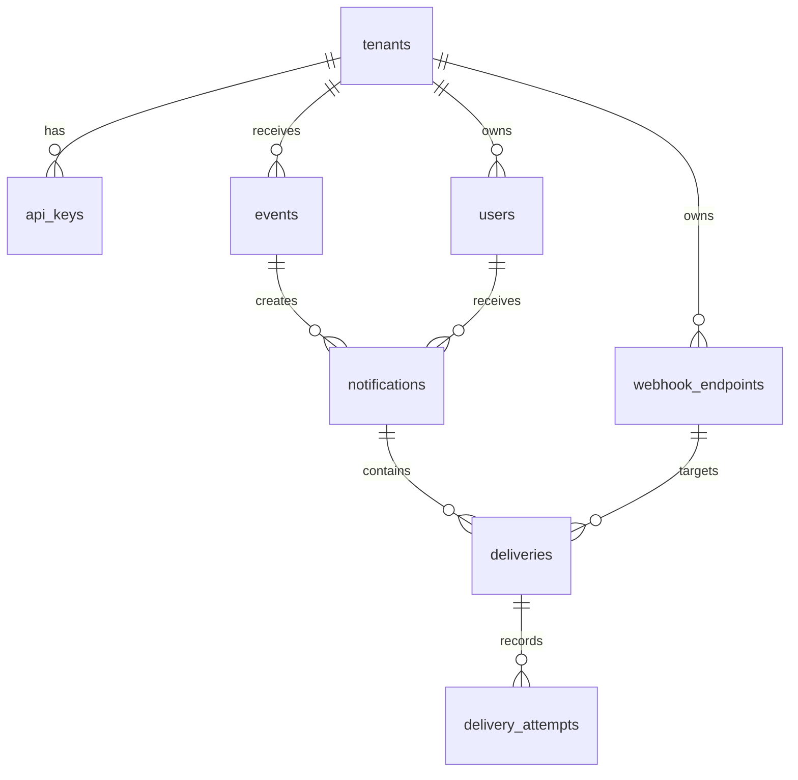

# Version 0 Database Design

## Role of PostgreSQL

PostgreSQL is the source of truth for tenant configuration, accepted events,
notification plans, current delivery state, and attempt history. In V0.1 it is
also the durable queue. This puts an accepted event and its planned work in one
transaction, avoiding a premature database/broker dual write.

Use PostgreSQL 16+, UTC `timestamptz`, and Alembic migrations. Prefer UUIDv7
generated in the application for index locality; `gen_random_uuid()` is suitable
for initial development. Never use ORM auto-create in a deployed environment.

## Relationship model



| Table | Purpose |
| --- | --- |
| `tenants` | Tenant identity and lifecycle. |
| `api_keys` | Hashed machine credentials and roles. |
| `users` | Tenant-owned recipients and email targets. |
| `webhook_endpoints` | Tenant outbound endpoints; one active default is used in V0. |
| `events` | Idempotently accepted producer events. |
| `notifications` | One logical event notification per recipient. |
| `deliveries` | One channel-specific job and current state. |
| `delivery_attempts` | Append-only provider-attempt audit. |

Every tenant-owned row has `tenant_id`, even where it can be derived from a
parent. This makes scoping and future row-level security clear. Child-table
foreign keys enforce matching tenant and parent IDs.

## Reference DDL

```sql
CREATE EXTENSION IF NOT EXISTS pgcrypto;

CREATE TYPE delivery_channel AS ENUM ('email', 'webhook', 'in_app');
CREATE TYPE delivery_status AS ENUM ('pending', 'processing', 'delivered', 'failed', 'suppressed');
CREATE TYPE api_key_role AS ENUM ('producer', 'admin');

CREATE TABLE tenants (
  id UUID PRIMARY KEY DEFAULT gen_random_uuid(),
  slug TEXT NOT NULL UNIQUE CHECK (slug ~ '^[a-z0-9][a-z0-9-]{1,62}$'),
  name TEXT NOT NULL,
  status TEXT NOT NULL DEFAULT 'active' CHECK (status IN ('active', 'disabled')),
  created_at TIMESTAMPTZ NOT NULL DEFAULT now(),
  updated_at TIMESTAMPTZ NOT NULL DEFAULT now()
);

CREATE TABLE api_keys (
  id UUID PRIMARY KEY DEFAULT gen_random_uuid(),
  tenant_id UUID NOT NULL REFERENCES tenants(id),
  key_prefix TEXT NOT NULL UNIQUE,
  secret_hash TEXT NOT NULL,
  role api_key_role NOT NULL DEFAULT 'producer',
  name TEXT NOT NULL,
  last_used_at TIMESTAMPTZ,
  revoked_at TIMESTAMPTZ,
  expires_at TIMESTAMPTZ,
  created_at TIMESTAMPTZ NOT NULL DEFAULT now(),
  UNIQUE (tenant_id, name)
);

CREATE TABLE users (
  id UUID PRIMARY KEY DEFAULT gen_random_uuid(),
  tenant_id UUID NOT NULL REFERENCES tenants(id),
  external_id TEXT NOT NULL,
  email TEXT,
  active BOOLEAN NOT NULL DEFAULT true,
  created_at TIMESTAMPTZ NOT NULL DEFAULT now(),
  updated_at TIMESTAMPTZ NOT NULL DEFAULT now(),
  UNIQUE (tenant_id, external_id),
  UNIQUE (tenant_id, id)
);

CREATE TABLE webhook_endpoints (
  id UUID PRIMARY KEY DEFAULT gen_random_uuid(),
  tenant_id UUID NOT NULL REFERENCES tenants(id),
  url TEXT NOT NULL CHECK (url ~ '^https://'),
  secret_ciphertext BYTEA NOT NULL,
  active BOOLEAN NOT NULL DEFAULT true,
  is_default BOOLEAN NOT NULL DEFAULT false,
  created_at TIMESTAMPTZ NOT NULL DEFAULT now(),
  updated_at TIMESTAMPTZ NOT NULL DEFAULT now(),
  UNIQUE (tenant_id, id)
);
CREATE UNIQUE INDEX one_active_default_webhook_per_tenant
  ON webhook_endpoints (tenant_id) WHERE active AND is_default;
```

```sql
CREATE TABLE events (
  id UUID PRIMARY KEY DEFAULT gen_random_uuid(),
  tenant_id UUID NOT NULL REFERENCES tenants(id),
  idempotency_key TEXT NOT NULL,
  request_hash TEXT NOT NULL,
  event_type TEXT NOT NULL,
  subject_type TEXT NOT NULL,
  subject_id TEXT NOT NULL,
  payload JSONB NOT NULL,
  metadata JSONB NOT NULL DEFAULT '{}'::jsonb,
  created_at TIMESTAMPTZ NOT NULL DEFAULT now(),
  UNIQUE (tenant_id, idempotency_key),
  UNIQUE (tenant_id, id),
  CHECK (jsonb_typeof(payload) = 'object'),
  CHECK (jsonb_typeof(metadata) = 'object')
);

CREATE TABLE notifications (
  id UUID PRIMARY KEY DEFAULT gen_random_uuid(),
  tenant_id UUID NOT NULL REFERENCES tenants(id),
  event_id UUID NOT NULL,
  user_id UUID NOT NULL,
  created_at TIMESTAMPTZ NOT NULL DEFAULT now(),
  UNIQUE (tenant_id, id),
  UNIQUE (event_id, user_id),
  FOREIGN KEY (tenant_id, event_id) REFERENCES events(tenant_id, id),
  FOREIGN KEY (tenant_id, user_id) REFERENCES users(tenant_id, id)
);

CREATE TABLE deliveries (
  id UUID PRIMARY KEY DEFAULT gen_random_uuid(),
  tenant_id UUID NOT NULL REFERENCES tenants(id),
  notification_id UUID NOT NULL,
  channel delivery_channel NOT NULL,
  status delivery_status NOT NULL DEFAULT 'pending',
  target_snapshot JSONB NOT NULL,
  webhook_endpoint_id UUID,
  attempt_count INTEGER NOT NULL DEFAULT 0 CHECK (attempt_count >= 0),
  max_attempts INTEGER NOT NULL DEFAULT 5 CHECK (max_attempts > 0),
  next_attempt_at TIMESTAMPTZ NOT NULL DEFAULT now(),
  lease_expires_at TIMESTAMPTZ,
  delivered_at TIMESTAMPTZ,
  failed_at TIMESTAMPTZ,
  read_at TIMESTAMPTZ,
  last_error_code TEXT,
  created_at TIMESTAMPTZ NOT NULL DEFAULT now(),
  updated_at TIMESTAMPTZ NOT NULL DEFAULT now(),
  UNIQUE (tenant_id, id),
  UNIQUE (notification_id, channel),
  FOREIGN KEY (tenant_id, notification_id) REFERENCES notifications(tenant_id, id),
  FOREIGN KEY (tenant_id, webhook_endpoint_id) REFERENCES webhook_endpoints(tenant_id, id),
  CHECK (jsonb_typeof(target_snapshot) = 'object'),
  CHECK ((status <> 'delivered') OR delivered_at IS NOT NULL),
  CHECK ((status <> 'failed') OR failed_at IS NOT NULL),
  CHECK ((channel <> 'webhook') OR webhook_endpoint_id IS NOT NULL),
  CHECK ((channel = 'webhook') OR webhook_endpoint_id IS NULL)
);

CREATE TABLE delivery_attempts (
  id UUID PRIMARY KEY DEFAULT gen_random_uuid(),
  tenant_id UUID NOT NULL REFERENCES tenants(id),
  delivery_id UUID NOT NULL,
  attempt_number INTEGER NOT NULL CHECK (attempt_number > 0),
  started_at TIMESTAMPTZ NOT NULL DEFAULT now(),
  completed_at TIMESTAMPTZ,
  outcome TEXT NOT NULL CHECK (outcome IN ('success', 'retryable_failure', 'permanent_failure')),
  provider_status_code INTEGER,
  provider_message TEXT,
  created_at TIMESTAMPTZ NOT NULL DEFAULT now(),
  UNIQUE (delivery_id, attempt_number),
  FOREIGN KEY (tenant_id, delivery_id) REFERENCES deliveries(tenant_id, id)
);
```

`target_snapshot` records the minimum safe target at planning time. Changing a
user email or endpoint later does not change audit history or redirect retries.
Examples: email `{ "email": "..." }`; in-app `{ "user_id": "..." }`; webhook
`{ "url": "..." }`. Webhook signing secrets are never snapshots. V0 uses a
tenant's active default webhook endpoint; per-user or multi-endpoint routing is a
deliberate later product addition.

## Required indexes

```sql
CREATE INDEX idx_api_keys_active ON api_keys (key_prefix) WHERE revoked_at IS NULL;
CREATE INDEX idx_events_tenant_created ON events (tenant_id, created_at DESC);
CREATE INDEX idx_notifications_tenant_created ON notifications (tenant_id, created_at DESC);
CREATE INDEX idx_notifications_user_created ON notifications (tenant_id, user_id, created_at DESC);
CREATE INDEX idx_deliveries_due ON deliveries (next_attempt_at, id) WHERE status = 'pending';
CREATE INDEX idx_deliveries_expired_lease ON deliveries (lease_expires_at, id) WHERE status = 'processing';
CREATE INDEX idx_deliveries_notification ON deliveries (tenant_id, notification_id);
CREATE INDEX idx_attempts_delivery ON delivery_attempts (tenant_id, delivery_id, attempt_number);
```

Do not create a generic GIN index on event payloads. Add a targeted index only
after an implemented and measured query requires it.

## Transactions

### Ingestion

1. Authenticate, derive tenant, validate the full request, and calculate the hash.
2. Insert the event. On unique-key conflict, load that tenant's existing event:
   return it for matching hash, otherwise return `409`.
3. Verify each recipient, resolve channel targets, then insert every notification
   and delivery in the same transaction. A valid recipient with no usable channel
   target receives a `suppressed` delivery rather than being silently redirected.
4. Commit and return `202`. If fan-out cannot be completely planned, roll back all
   rows: an accepted event always has a complete audit trail.

### Worker claim and completion

Claim a bounded batch with `FOR UPDATE SKIP LOCKED`, commit, call providers, then
make a short completion transaction. Never hold a database transaction during a
provider HTTP call.

```sql
WITH due AS (
  SELECT id FROM deliveries
  WHERE (status = 'pending' AND next_attempt_at <= now())
     OR (status = 'processing' AND lease_expires_at < now())
  ORDER BY next_attempt_at, id
  FOR UPDATE SKIP LOCKED
  LIMIT :batch_size
)
UPDATE deliveries d
SET status = 'processing', attempt_count = d.attempt_count + 1,
    lease_expires_at = now() + interval '60 seconds', updated_at = now()
FROM due WHERE d.id = due.id
RETURNING d.*;
```

The completion transaction appends `delivery_attempts` and transitions the row to
`delivered`, `pending` with future `next_attempt_at`, or `failed`. The provider
call gap is why delivery is at-least-once and requires stable provider keys.

## State transitions

| From | To | Condition |
| --- | --- | --- |
| `pending` | `processing` | Worker claims eligible work. |
| `processing` | `delivered` | Provider accepts send or in-app item is available. |
| `processing` | `pending` | Retryable error with attempts remaining. |
| `processing` | `failed` | Permanent error or attempts exhausted. |
| `pending` | `suppressed` | Target unavailable or preference blocks send. |
| `processing` | `processing` | Expired lease is reclaimed and attempt count increases. |

`delivered`, `failed`, and `suppressed` are terminal. Manual redrive is a future
administrative feature and must preserve attempt history.

## Security, operations, and measurements

- Store only a slow hash or verifier of API-key secrets; reveal a generated secret once.
- Encrypt webhook secrets; never return, log, snapshot, or include them in errors.
- Bound and redact provider diagnostics. Payloads may hold personal data, so logs,
  database access, retention, and deletion need an explicit policy before regulated use.
- Before non-development use, add PostgreSQL row-level security based on a validated
  per-transaction tenant setting; design connection-pool reset and DB privileges first.

Record ingestion latency, due queue depth, p50/p95/p99 delivery lag by channel,
retry and terminal-failure rate by provider, and expired-lease recovery count.
These measurements are the evidence for adding Redis, Kafka, or separate workers.

```sql
SELECT channel, status, count(*)
FROM deliveries
WHERE created_at >= now() - interval '1 hour'
GROUP BY channel, status
ORDER BY channel, status;
```

## Trade-offs

- JSONB permits heterogeneous producer events without premature schemas; it trades
  off database-level validation and free-form querying.
- A PostgreSQL queue is transactionally coupled and simple; polling limits
  throughput, so replace it only when measurement justifies a broker.
- Append-only attempts cost storage but make failures and retries explainable.
- Target snapshots favor audit-safe retry behavior over automatically applying a
  later address change; “use current address” requires a future explicit policy.
